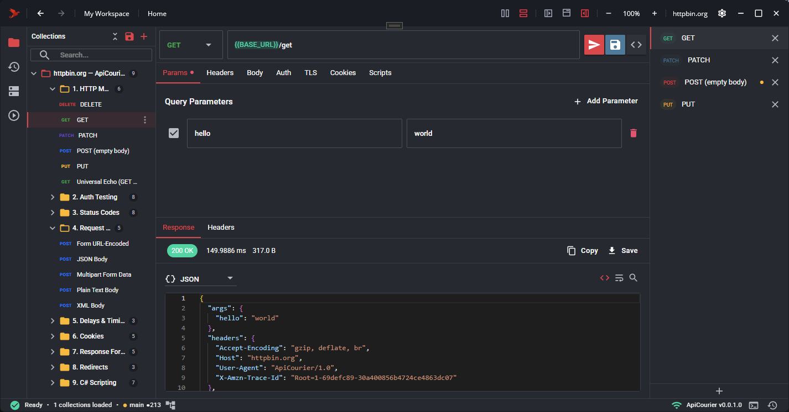

<div align="center">


# ApiCourier

### The API client that speaks C# - and tests your database.

**NuGet-powered C# scripting, first-class SQL queries, and a smart mock gateway.**
Git-native, offline-first, and built for .NET teams - useful for anyone tired of `200 OK` lying to them.

<br />

[](https://apicourier.dev)
[-2563EB?style=for-the-badge)](https://apicourier.dev/download)
[](https://docs.apicourier.dev)
[](https://discord.gg/apicourier)

[](https://dotnet.microsoft.com/)
[-64748B)](https://apicourier.dev/roadmap)
[](https://apicourier.dev/#pricing)
[-475569)](https://apicourier.dev/license)

<br />



</div>

---

## Quick links

| I want to… | Go here |
|---|---|
| **Download ApiCourier** | **[apicourier.dev/download](https://apicourier.dev/download)** |
| **Read the docs** | **[docs.apicourier.dev](https://docs.apicourier.dev)** |
| **Report a bug** | **[New bug report](https://github.com/apicourier/apicourier/issues/new?template=bug_report.yml)** |
| **Request a feature** | **[New feature request](https://github.com/apicourier/apicourier/issues/new?template=feature_request.yml)** |
| **Get help / ask a question** | **[New support request](https://github.com/apicourier/apicourier/issues/new?template=support_request.yml)** |
| **Chat with the community** | **[Discord](https://discord.gg/apicourier)** |
| **Private / licensing support** | **[support@apicourier.dev](mailto:support@apicourier.dev)** |
| **See what's next** | **[Roadmap](https://apicourier.dev/roadmap)** |
| **What changed** | **[Changelog](https://apicourier.dev/changelog)** · [GitHub Releases](https://github.com/apicourier/apicourier/releases) |
| **Talk to us about Teams** | **[Contact](https://apicourier.dev/contact)** |

> **About this repository.** This is the public home for ApiCourier - downloads, release notes, the issue tracker, and the roadmap. The desktop app is a commercial product; the application source is not published here. Found something? **[Open an issue](https://github.com/apicourier/apicourier/issues/new/choose)** - we read every one.

---

## Why .NET teams pick ApiCourier

Parity with Postman/Bruno/Insomnia on the basics, real asymmetry where it matters: **C#, databases, and mocks.**

### Write tests in C#, not JavaScript
Pre- and post-request scripting on the **full .NET runtime** via Roslyn - strongly-typed request/response handling, LINQ, records, and pattern matching. Import any **NuGet package** (Pro). No more JavaScript translation tax on a .NET codebase.

```csharp
// Post-request script - C#
var user = ac.Response.Json();
ac.Expect(user.id).To.Equal(123);
ac.Environment.Set("userId", user.id);
```

> Prefer JS? A **Postman-compatible JavaScript engine** (ClearScript V8) ships in the box. Your existing Postman scripts run as-is. Mix and match per request.

### SQL queries as first-class artifacts `1.0`
Git-tracked, parameterized SQL that composes with HTTP requests in flows - **verify the API actually wrote what it said it did.** SQLite ships **free**; Pro adds **Postgres, MSSQL, and MySQL**. Mixed HTTP + SQL flows share variables and detect **schema drift** on result sets.

### Smart Mock Gateway: mock, proxy, or both `1.0`
Hybrid routing with priority path matching (exact → pattern → wildcard → proxy fallback). YAML-defined collections, **scripted dynamic mocks** in C# or JS, and three modes (mock-only, hybrid, proxy-only) for contract and integration tests. Stand up a contract-test environment in minutes.

### Git-native, YAML-stored, offline-forever
Collections, environments, and schemas live as plain **YAML next to your code**. Commit, diff, branch, and review like real source. **There is no cloud - and never will be.** Secrets never leave your machine.

### Perpetual fallback license - no rug-pulls
JetBrains-style licensing: after **12 consecutive paid months**, every Pro feature you've licensed keeps working on your machine, **forever**. No remote kill switches, no surprise bills. Cancel anytime, keep what you've paid for.

> **Looking for a fallback build?** Every release - including the older versions covered by your fallback cutoff date - is archived on **[GitHub Releases](https://github.com/apicourier/apicourier/releases)**. The [Download page](https://apicourier.dev/download) always serves the latest build; use Releases to grab the specific version your perpetual license covers. See [how the fallback license works](https://apicourier.dev/license).

### Native .NET desktop performance
Built with **.NET MAUI + Blazor Hybrid** - native desktop performance without Electron bloat. Fast startup, low memory, smooth UI. The tool feels like the stack it's built for.

---

## How ApiCourier compares

| Feature | ApiCourier | Postman | Bruno | Insomnia |
|---|:---:|:---:|:---:|:---:|
| Git-native file storage | ✅ | ❌ | ✅ | Partial |
| 100% offline capable | ✅ | Limited | ✅ | ✅ |
| **C# scripting with NuGet imports** | ✅ | ❌ | ❌ | ❌ |
| **SQL queries as artifacts** (SQLite free · Postgres/MSSQL/MySQL Pro) | `1.0` | Script only | ❌ | Plugins |
| **Smart Mock Gateway** (hybrid proxy/mock) | `1.0` | Cloud-only, capped | ❌ | ❌ |
| **Mixed HTTP + SQL flows** with schema drift | `1.0` | ❌ | ❌ | ❌ |
| GraphQL, WebSocket, gRPC | ✅ | ✅ | ❌ | Partial |
| Native desktop performance | ✅ | Electron | Electron | Electron |
| Perpetual fallback license | ✅ | ❌ | ❌ | ❌ |
| **Starting price (Pro)** | **$5/mo** | $19/user/mo | $6/user/mo | $12/user/mo |

<sub>`1.0` = shipping in the v1.0 release. Insiders get these builds as they roll out ahead of general availability.</sub>

---

## Get started in under 3 minutes

From an OpenAPI spec to a C# test suite in your own Git repo.

1. **Import OpenAPI** - Drop your OpenAPI 3.x spec (or a Postman / Bruno / cURL collection) into ApiCourier. It auto-generates collections, auth, and folder structure.
2. **Write tests in C#** - Send requests, add strongly-typed assertions, and configure environments. Pre/post-request scripting runs on the full .NET runtime.
3. **Commit & share** - Collections are YAML files in your repo. Commit, review diffs, and share via Git like any other code.

```bash
git add collections/
git commit -m "Add user endpoints"
git push
```

Full walkthrough: **[docs.apicourier.dev](https://docs.apicourier.dev)**

---

## CLI & CI/CD

ApiCourier ships with a command-line runner for headless execution in your pipelines, with **JUnit XML** and **JSON** reporters.

```bash
# Run a collection or flow in CI and emit JUnit XML
apicourier run ./collections/users.flow.yaml --reporter junit --out results.xml
```

Wire the output into GitHub Actions, Azure DevOps, GitLab CI, or any runner that understands JUnit. See the **[CLI docs](https://docs.apicourier.dev)** for the full command reference.

---

## What's in the box

**Shipped & stable**

- Full **HTTP/HTTPS** client - all methods, headers, Bearer/Basic/API-Key auth, OAuth 2.0, client certs & custom CA bundles
- **GraphQL**, **WebSocket**, and **gRPC** clients (schema introspection, server reflection, message templates)
- **C# scripting** (Roslyn) and **JavaScript scripting** (ClearScript V8, Postman-compatible)
- **Environments & variables** with nested substitution and circular-reference detection
- **Flow Runner** - sequential and advanced flows with branching, conditions, retries, and CSV/JSON data runs
- **Import** from OpenAPI 3.0/3.1, Swagger 2.0, Postman (v2.0/v2.1), Bruno, and cURL
- **Code generation** - export requests as C#, JavaScript, Python, or cURL
- **Git integration** - commit UI, branch context, status panel, file watching, smart commit messages
- **Smart Gateway** - local intercept/mock gateway with hot-reload, traffic recording (HAR/YAML), chaos engineering (latency & fault injection), contract drift detection, gateway scripting, and a PCI compliance redaction pack
- **CLI** with JUnit/JSON reporters for CI/CD

**Coming in v1.0** `1.0`

- First-class **SQL queries** (SQLite free; Postgres/MSSQL/MySQL Pro)
- **Mixed HTTP + SQL flows** with shared variables & schema-drift detection
- **Smart Mock Gateway** - hybrid proxy/mock routing
- **NuGet & NPM** package imports in Pro scripts

See the full **[Roadmap](https://apicourier.dev/roadmap)**

---

## Editions

| | Free | Pro | Team | Enterprise |
|---|---|---|---|---|
| **Price** | **$0** forever | **$5/mo** ($50/yr) | **$15**/user/mo | **$35**/user/mo |
| Full API client, unlimited collections | ✅ | ✅ | ✅ | ✅ |
| HTTP · GraphQL · gRPC · WebSocket | ✅ | ✅ | ✅ | ✅ |
| C# & JS scripting (sandboxed) | ✅ | ✅ | ✅ | ✅ |
| SQL queries (**SQLite**) `1.0` | ✅ | ✅ | ✅ | ✅ |
| CLI + JUnit XML for CI/CD | ✅ | ✅ | ✅ | ✅ |
| NuGet/NPM imports · SQL network engines `1.0` | ❌ | ✅ | ✅ | ✅ |
| Smart Mock Gateway · advanced flows · Git UI `1.0` | ❌ | ✅ | ✅ | ✅ |
| Perpetual fallback license | ❌ | ✅ | ✅ | ✅ |
| Shared environments, schema registry, team dashboards | ❌ | ❌ | ✅ | ✅ |
| SSO/SCIM, secret vaults, audit logging, RBAC | ❌ | ❌ | ❌ | ✅ |

**[Compare full plans](https://apicourier.dev/#pricing)** · Every Pro feature you've paid for keeps working - **[how the perpetual fallback license works](https://apicourier.dev/license)**.

---

## Platform support

| Platform | Status |
|---|---|
| **Windows 10 / 11** | Fully supported & stable |
| **macOS** (Intel + Apple Silicon) | Active beta - builds shipping now |
| **Linux** | Planned |
| **Web** (Blazor WebAssembly) | Planned (after 1.0) |

**[Download the latest build](https://apicourier.dev/download)** · Older versions (including perpetual-fallback builds) are archived on **[GitHub Releases](https://github.com/apicourier/apicourier/releases)**.

---

## Support & community

- **[Discord](https://discord.gg/apicourier)** - usage help, tips, and general discussion
- **[Issue tracker](https://github.com/apicourier/apicourier/issues)** - bugs, feature requests, and support questions (templates provided)
- **[support@apicourier.dev](mailto:support@apicourier.dev)** - private support for licensing, account, or sensitive issues
- **[Documentation](https://docs.apicourier.dev)** - guides, references, and examples

When filing a bug, the template will ask for your **app version**, **OS/platform**, and **steps to reproduce** - having those ready helps us triage fast.

---

## Roadmap highlights

- **In progress:** macOS support · response-viewing enhancements (JSONPath builder, full-text search)
- **Next up:** SQL queries as artifacts · GraphQL gateway · shadow/conformance mode · compliance redaction packs (HIPAA, GDPR) · Linux support
- **Future:** web version · team collaboration · capability marketplace + SDK · API↔DB correlation diff view · stateful mock scenarios · protocol extensions (WebSocket/gRPC/SSE)

Full, always-current roadmap: **[apicourier.dev/roadmap](https://apicourier.dev/roadmap)**

---

## Legal

ApiCourier is a commercial product of **ApiCourier LLC**.

- [License / EULA](https://apicourier.dev/license)
- [Privacy Policy](https://apicourier.dev/privacy)
- [Terms of Service](https://apicourier.dev/terms)
- [Third-Party Notices](https://apicourier.dev/third-party-notices)

<div align="center">
<br />

**Built by developers, for developers.**

[Website](https://apicourier.dev) · [Download](https://apicourier.dev/download) · [Docs](https://docs.apicourier.dev) · [Discord](https://discord.gg/apicourier) · [Roadmap](https://apicourier.dev/roadmap)

<sub>© ApiCourier LLC - C# · Git-Native · Offline-First</sub>

</div>
